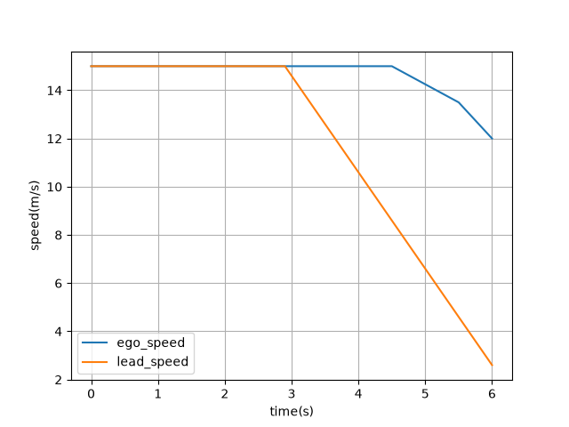
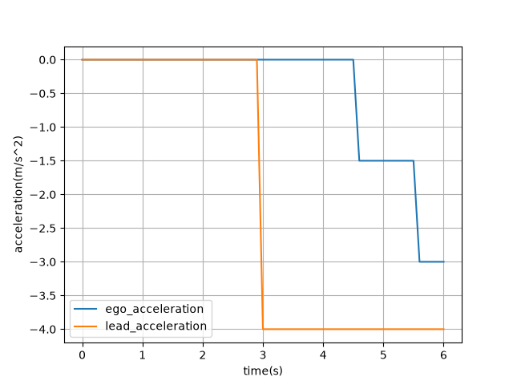
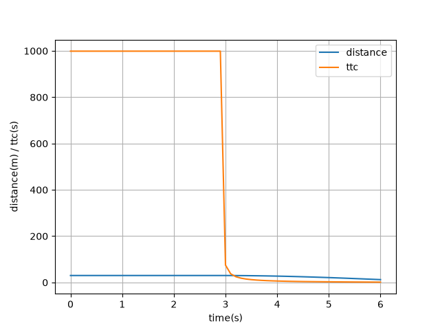

# 自动驾驶跟车制动场景仿真与离线分析原型

本项目是一个面向自动驾驶仿真测试 / 路测测试实习准备的小型练习项目。项目定位是“跟车制动场景仿真与日志离线分析原型”，不是完整自动驾驶算法项目。

当前版本使用 C++17 实现简化车辆纵向运动仿真，构造前车制动场景，输出 CSV 仿真日志；再使用 Python 读取日志并绘制速度、加速度、车距和 TTC 曲线。

## 当前功能

- 使用 CMake 管理 C++17 项目
- 实现 `Vehicle` 自车模型
- 实现 `LeadVehicle` 前车模型，支持指定时间开始制动
- 实现 `Controller` 简单跟车控制逻辑
- 实现 `Logger` 输出 CSV 仿真日志
- 计算两车距离 `distance`
- 计算简化 TTC 指标
- 输出 `throttle`、`brake`、`ttc` 等分析字段
- 使用 Python、pandas、matplotlib 读取 CSV 并生成曲线图

## 项目结构

```text
auto-driving-sim-evaluation/
├── CMakeLists.txt
├── README.md
├── requirements.txt
├── include/
│   ├── Vehicle.h
│   ├── LeadVehicle.h
│   ├── Controller.h
│   └── Logger.h
├── src/
│   ├── Vehicle.cpp
│   ├── LeadVehicle.cpp
│   ├── Controller.cpp
│   ├── Logger.cpp
│   └── main.cpp
├── scripts/
│   └── analyze_log.py
├── data/
│   └── .gitkeep
├── result/
│   └── .gitkeep
└── docs/
    ├── interview_notes.md
    └── images/
        ├── example_speed_curve.png
        ├── acceleration_curve.png
        └── distance_ttc_curve.png
```

说明：

- `data/log.csv` 是运行仿真后生成的日志文件，默认不提交到 Git。
- `result/*.png` 是运行 Python 脚本后生成的图片，默认不提交到 Git。
- `docs/images/` 保存一组示例结果图，用于 README 展示。

## 编译和运行 C++ 仿真

在项目根目录执行：

```bash
cmake -S . -B builder
cmake --build builder
./bin/simulator
```

运行后会生成：

```text
data/log.csv
```

## CSV 字段说明

`data/log.csv` 包含以下字段：

| 字段 | 含义 |
| --- | --- |
| `time` | 仿真时间，单位 s |
| `ego_position` | 自车位置，单位 m |
| `ego_speed` | 自车速度，单位 m/s |
| `ego_acceleration` | 自车加速度，单位 m/s^2 |
| `lead_position` | 前车位置，单位 m |
| `lead_speed` | 前车速度，单位 m/s |
| `lead_acceleration` | 前车加速度，单位 m/s^2 |
| `distance` | 前车与自车距离，单位 m |
| `throttle` | 简化油门指令 |
| `brake` | 简化制动指令 |
| `ttc` | 简化碰撞时间指标，单位 s |

当前 TTC 计算方式：

```text
relativeVelocity = ego_speed - lead_speed

如果 relativeVelocity <= 0，说明自车没有追近前车，TTC 记为 999。
如果 relativeVelocity > 0，TTC = distance / relativeVelocity。
```

## Python 离线分析

第一次运行前安装依赖：

```bash
python3 -m venv .venv
source .venv/bin/activate
pip install -r requirements.txt
```

先运行 C++ 仿真生成 CSV：

```bash
./bin/simulator
```

再运行 Python 分析脚本：

```bash
python scripts/analyze_log.py
```

运行后会生成：

```text
result/speed_curve.png
result/acceleration_curve.png
result/distance_ttc_curve.png
```

## 示例结果

速度曲线：



加速度曲线：



车距和 TTC 曲线：



## 当前场景说明

当前场景参数写在 `src/main.cpp` 中：

```cpp
Vehicle egoVehicle(0.0,15.0);
LeadVehicle leadVehicle(30.0,15.0,3.0,-4.0);
const double dt=0.1;
const double totalTime=6.0;
```

含义：

- 自车初始位置 0 m，初始速度 15 m/s
- 前车初始位置 30 m，初始速度 15 m/s
- 前车在 3 s 后以 -4 m/s^2 制动
- 仿真步长 0.1 s
- 总仿真时间 6 s

`Controller` 当前使用简单规则：

- `distance < 10 m` 或 `TTC < 2 s` 时重刹
- `distance < 20 m` 或 `TTC < 4 s` 时轻刹
- `distance > 35 m` 时轻微加速
- 其他情况保持当前速度

## 项目边界

当前项目是学习用的简化原型，有以下边界：

- 不是真实自动驾驶系统
- 不是真实 AEB 算法
- 没有使用 ROS / Carla
- 没有处理真实路测数据
- 车辆模型是简化纵向运动模型
- 当前不支持 JSON 场景配置
- 当前不支持批量运行多个测试 case
- 当前没有生成 `result_summary.csv`
- 当前没有实现异常值自动检测

## 和自动驾驶测试岗位的关系

这个项目对应自动驾驶测试中的基础工作流：

```text
构造测试场景 -> 运行仿真 -> 输出日志 -> 离线读取日志 -> 绘制曲线 -> 观察风险指标
```

项目重点不是复杂控制算法，而是理解测试数据如何产生、如何记录、如何分析。

## 后续可扩展方向

- 使用 JSON 管理场景参数
- 支持多个场景批量运行
- 自动检测 TTC 风险片段和车距风险片段
- 自动检测急刹不舒适片段
- 自动生成 `result_summary.csv`
- 对比不同制动策略，例如 `fixed_brake`、`distance_threshold`、`ttc_trigger`

## 简历描述示例

```text
自动驾驶跟车制动场景仿真与离线分析原型
基于 C++17/CMake 实现简化车辆纵向运动仿真，构造前车制动场景，并输出包含速度、加速度、车距、TTC、制动状态等字段的 CSV 日志；使用 Python、pandas、matplotlib 对日志进行离线读取和曲线绘制，辅助观察跟车制动过程中的风险变化。
```
